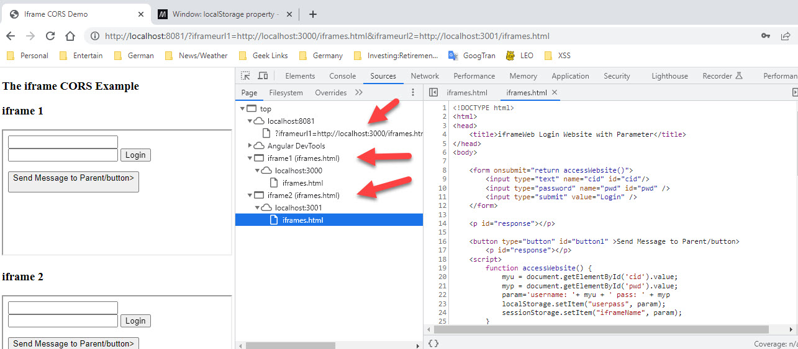
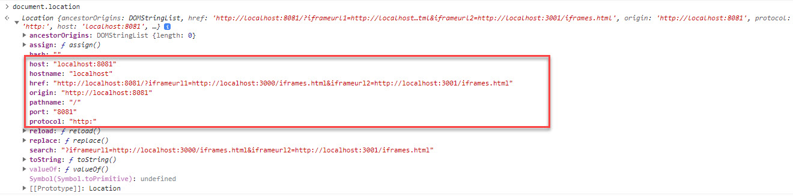
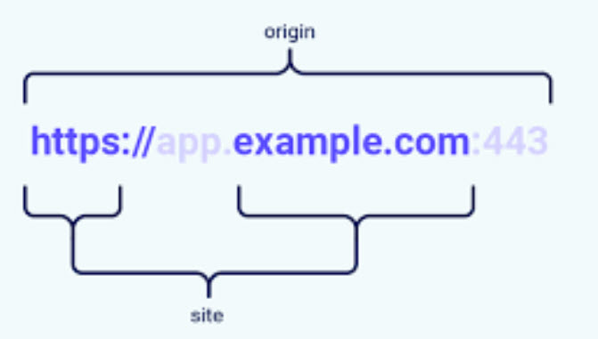

<!-- vscode-markdown-toc -->

- 1. [Background](#Background)
  - 1.1. [Lesson 1: Where does Origin Come From?](#Lesson1:WheredoesOriginComeFrom)
  - 1.2. [Lesson 2: Site vs Origin..](#Lesson2:SitevsOrigin..)

<!-- vscode-markdown-toc-config
	numbering=true
	autoSave=true
	/vscode-markdown-toc-config -->
<!-- /vscode-markdown-toc -->

# Browser Security Lab

TBD-

- cookies
- check local storage too
- read only response
- send credentials
- force origin in post

## 1. Background

One of the elements missing when watching YouTube videos explaining technology, is the hands on experience
to explore the "What Ifs" along with seeing both sides of the client-server interaction on a step-by-step
basis. This is the only way to fully understand how a technology works.

Browser Security is a super-complex topic because there never was no top-down structure to it. As browser attacks occurred, new countermeasures were created adhoc. Different browsers may or may not implement those countermeasures depending on the version one is using. One countermeasure may or maynot work with a different countermeasure. Lots of "always true EXCEPT in the case of..."

This lab provides both the front and backend components to test browser security. This lab was created so that one can view step-by-step how browsers and backends implement browser security countermeasures. With this lab one can breakpoint debug step-by-step the interactions between browsers and backends as they attempt to implement a countermeasure.

What are the topics you can explore with this lab?

0. Browser Security Basics
0. SSP - Same Site Policy
1. SOP - Same Origin Policy
2. CSRF - Cookie Attack
2. CORS - Cross Origin Requests
3. XSS - Cross Site Scripting
3. CSP - XSS prevention policies
5. SEC- Headers
6. OpenID and OAuth
7. Cookies vs JWT and Browser Storage

So sit back and take a few pain pills before you embark on this journey!!

### 1.1. Lesson 1: Where does Origin Come From?

When a browser/render loads a page from a website, the browser tags that page with a Origin attribute in the DOM. This attribute is used to determine which windows/frames can see what data.

### 1.2. Lesson 2: Site vs Origin..

Same Origin Policy states that JavaScript cannot access data across Origins. What is an Origin?
An origin is very strict, the whole url domain from 'h' to portnumber will make a match. Subdomains are not in the same Origin.
Site is more flexible, subdomains are in the same Site. These are used in cookie restrictions.

So for SOP, scripts in evil.com inside a web page cannot access the cookies of good.com.  
CORS is a method of allowing that interaction to happen with limitations.

# Change History

- Michael Endrizzi - Author - June 2023 - Security Architect/Training/Shift Left Advocate
-

# Contributing

Pull requests are welcome. For major changes, please open an issue first
to discuss what you would like to change.

Please make sure to update tests as appropriate.

# License

- [MIT](https://choosealicense.com/licenses/mit/)
- [GO](https://go.dev/LICENSE)
